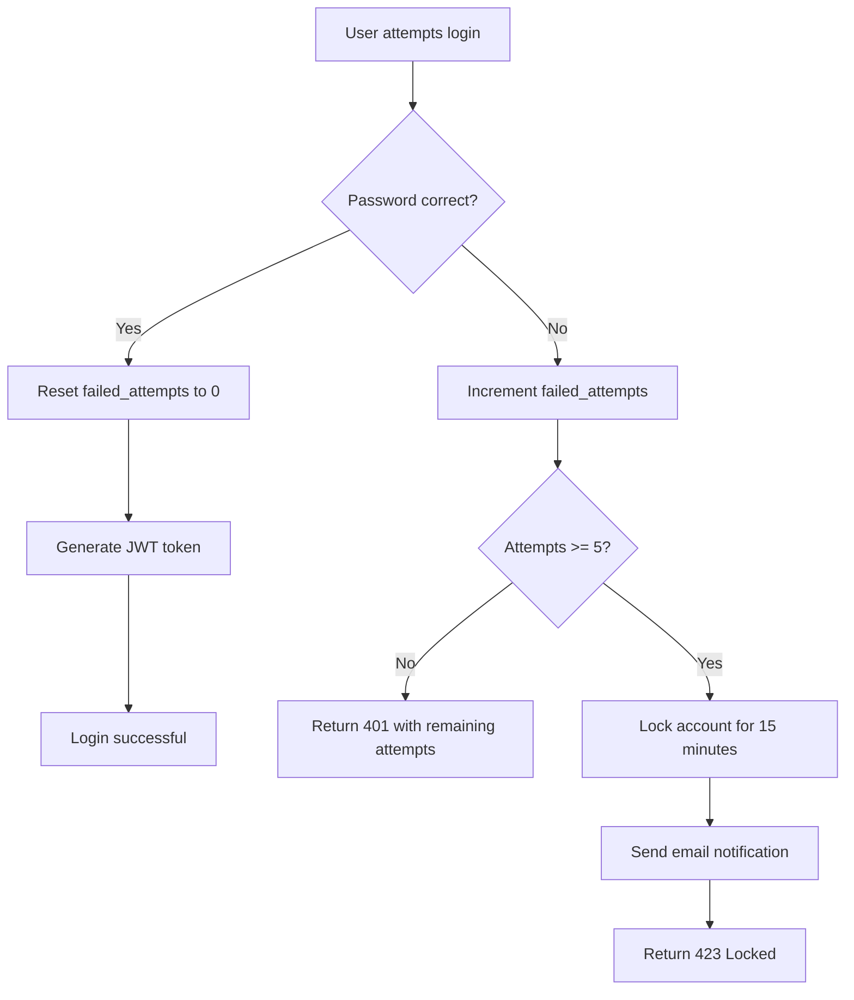

# Account Lockout Protection - Droplin Backend

## Overview

Comprehensive account lockout mechanism to protect against brute force login attacks. Accounts are temporarily locked after multiple failed login attempts, with email notifications sent to the account owner.

---

## Features

✅ **Automatic lockout** after 5 failed login attempts  
✅ **15-minute lockout duration**  
✅ **Real-time attempt tracking** with remaining attempts shown  
✅ **Email notifications** when account is locked  
✅ **Automatic unlock** after lockout period expires  
✅ **Manual unlock** endpoint for admins  
✅ **423 Locked status code** with Retry-After header  

---

## How It Works

### Login Attempt Flow



### Account State

| State | Description | HTTP Code |
|-------|-------------|-----------|
| **Normal** | failed_attempts < 5, no lockout | 200 on success, 401 on wrong password |
| **Warned** | failed_attempts 1-4 | 401 + "X attempts remaining" message |
| **Locked** | failed_attempts >= 5, locked_until set | 423 Locked + Retry-After header |
| **Expired Lock** | locked_until < current time | Automatically reset to Normal |

---

## Database Schema

### New Columns in `users` Table

```sql
failed_login_attempts INTEGER DEFAULT 0
locked_until TEXT  -- ISO 8601 timestamp
```

**Example Data:**

| id | username | failed_login_attempts | locked_until |
|----|----------|----------------------|--------------|
| 1 | john | 0 | NULL |
| 2 | alice | 3 | NULL |
| 3 | bob | 5 | 2025-10-27T15:30:00 |

---

## API Behavior

### Login Endpoint: `POST /auth/login`

#### Scenario 1: Successful Login
```bash
POST /auth/login
{
  "username": "john",
  "password": "correct_password"
}
```

**Response: 200 OK**
```json
{
  "token": "eyJhbGciOiJIUzI1NiIsInR5cCI6IkpXVCJ9...",
  "user_id": 1,
  "username": "john"
}
```

**Result:** `failed_login_attempts` reset to 0

---

#### Scenario 2: First Failed Attempt
```bash
POST /auth/login
{
  "username": "john",
  "password": "wrong_password"
}
```

**Response: 401 Unauthorized**
```json
{
  "detail": "Invalid username or password. 4 attempts remaining before account lockout."
}
```

**Result:** `failed_login_attempts` = 1

---

#### Scenario 3: Fourth Failed Attempt
```bash
POST /auth/login
{
  "username": "john",
  "password": "wrong_password"
}
```

**Response: 401 Unauthorized**
```json
{
  "detail": "Invalid username or password. 1 attempts remaining before account lockout."
}
```

**Result:** `failed_login_attempts` = 4

---

#### Scenario 4: Fifth Failed Attempt (Account Locked)
```bash
POST /auth/login
{
  "username": "john",
  "password": "wrong_password"
}
```

**Response: 423 Locked**
```json
{
  "detail": "Account locked due to multiple failed login attempts. Try again in 15 minutes."
}
```

**Headers:**
```
Retry-After: 900  (seconds)
```

**Result:** 
- `failed_login_attempts` = 5
- `locked_until` = current_time + 15 minutes
- Email notification sent to user

---

#### Scenario 5: Login While Locked
```bash
POST /auth/login
{
  "username": "john",
  "password": "any_password"
}
```

**Response: 423 Locked**
```json
{
  "detail": "Account locked due to multiple failed login attempts. Try again in 12 minutes."
}
```

**Headers:**
```
Retry-After: 720  (remaining seconds)
```

**Result:** Login blocked, lockout continues

---

#### Scenario 6: Login After Lockout Expires
```bash
POST /auth/login
{
  "username": "john",
  "password": "correct_password"
}
```

**Response: 200 OK** (if password correct)
```json
{
  "token": "eyJhbGciOiJIUzI1NiIsInR5cCI6IkpXVCJ9...",
  "user_id": 1,
  "username": "john"
}
```

**Result:** 
- Lockout automatically cleared
- `failed_login_attempts` reset to 0
- `locked_until` set to NULL

---

## Email Notification

When an account is locked, an email is sent to the user's registered email address.

### Email Template

**Subject:** 🔒 Account Locked - DropLink Security Alert

**Content:**
- Notification that account has been locked
- Lockout duration (15 minutes)
- Reason (5 failed login attempts)
- Instructions on what to do next
- Security warning if it wasn't them

### Sample Email

```
Hello john,

Your account has been temporarily locked due to multiple failed login attempts.

LOCKOUT DURATION: 15 minutes
You can try logging in again after this time period.

WHAT HAPPENED?
We detected 5 consecutive failed login attempts to your account. To protect 
your account security, we've temporarily locked it.

WHAT SHOULD YOU DO?
- If this was you, wait 15 minutes and try again with the correct password
- If you forgot your password, use the "Forgot Password" feature to reset it
- If you didn't try to log in, someone may be attempting to access your account

⚠️ SECURITY WARNING:
If you didn't attempt to log in, we recommend changing your password immediately 
after the lockout period ends.
```

---

## Manual Unlock Endpoint

### `POST /auth/unlock-account`

**Purpose:** Manually unlock a locked account (requires authentication)

**Request:**
```bash
curl -X POST https://your-backend.com/auth/unlock-account \
  -H "Authorization: Bearer YOUR_ADMIN_TOKEN" \
  -H "Content-Type: application/json" \
  -d '{"username": "john"}'
```

**Response: 200 OK**
```json
{
  "success": true,
  "message": "Account 'john' has been unlocked successfully",
  "username": "john"
}
```

**Result:**
- `failed_login_attempts` = 0
- `locked_until` = NULL
- User can log in immediately

**Note:** Currently, any authenticated user can unlock accounts. In production, implement proper admin role checking.

---

## Configuration

### Lockout Settings

| Setting | Value | Location | Can Change? |
|---------|-------|----------|-------------|
| **Max Failed Attempts** | 5 | `main.py` line 1037 | Yes, edit code |
| **Lockout Duration** | 15 minutes | `main.py` line 1038 | Yes, edit code |
| **Email Notification** | Enabled | `send_lockout_notification()` | Automatic |

### To Change Settings

**Change max attempts (e.g., to 3):**
```python
# Line 1037
if failed_attempts >= 3:  # Changed from 5 to 3
```

**Change lockout duration (e.g., to 30 minutes):**
```python
# Line 1038
lock_duration = timedelta(minutes=30)  # Changed from 15 to 30
```

---

## Security Benefits

✅ **Prevents brute force attacks** - Attackers can't try unlimited passwords  
✅ **Protects user accounts** - Locks account if someone tries to guess password  
✅ **Email alerts** - Users know if someone is trying to access their account  
✅ **Automatic recovery** - No manual intervention needed after lockout expires  
✅ **Rate limiting** - 5 attempts per 15 minutes = max 20 attempts/hour  
✅ **User feedback** - Shows remaining attempts before lockout  

---

## Testing

### Test Lockout Mechanism

```bash
# 1. Try 5 wrong passwords
for i in {1..5}; do
  curl -X POST http://localhost:8081/auth/login \
    -H "Content-Type: application/json" \
    -d '{"username": "testuser", "password": "wrongpass'$i'"}'
  echo "\nAttempt $i"
done

# Expected:
# Attempt 1-4: 401 with remaining attempts message
# Attempt 5: 423 Locked with 15-minute message

# 2. Try logging in while locked
curl -X POST http://localhost:8081/auth/login \
  -H "Content-Type: application/json" \
  -d '{"username": "testuser", "password": "anypassword"}'

# Expected: 423 Locked with time remaining

# 3. Manually unlock (requires JWT token)
curl -X POST http://localhost:8081/auth/unlock-account \
  -H "Authorization: Bearer YOUR_TOKEN" \
  -H "Content-Type: application/json" \
  -d '{"username": "testuser"}'

# Expected: 200 OK, account unlocked

# 4. Try logging in with correct password
curl -X POST http://localhost:8081/auth/login \
  -H "Content-Type: application/json" \
  -d '{"username": "testuser", "password": "correctpassword"}'

# Expected: 200 OK with JWT token
```

---

## Edge Cases Handled

✅ **Expired lockout** - Automatically cleared on next login attempt  
✅ **Invalid timestamp** - Reset lockout if timestamp is corrupted  
✅ **Email failure** - Lockout still applied even if email fails  
✅ **Successful login** - Always resets failed attempts to 0  
✅ **Missing email** - Lockout works without email notification  
✅ **Database types** - Works with both SQLite and PostgreSQL  

---

## Error Codes

| Code | Status | Meaning |
|------|--------|---------|
| 200 | OK | Login successful |
| 401 | Unauthorized | Wrong password, attempts remaining |
| 423 | Locked | Account locked, retry after X minutes |
| 404 | Not Found | Username doesn't exist (unlock endpoint) |
| 500 | Internal Server Error | Database or system error |

---

## Monitoring & Logs

### Successful Lockout
```
🔒 Account locked for user: john
✅ Lockout notification sent to john@example.com. Status: 202
```

### Manual Unlock
```
✅ Account unlocked for user: john (by admin user_id: 1)
```

### Email Notification (no SendGrid)
```
⚠️ SendGrid not configured. LOCKOUT NOTIFICATION for john@example.com (user: john)
🔒 Account locked for 15 minutes
```

---

## Mobile App Integration

### Handle 423 Locked Response

```javascript
async function handleLogin(username, password) {
  try {
    const response = await fetch('/auth/login', {
      method: 'POST',
      headers: { 'Content-Type': 'application/json' },
      body: JSON.stringify({ username, password })
    });
    
    if (response.status === 423) {
      // Account is locked
      const data = await response.json();
      const retryAfter = response.headers.get('Retry-After'); // seconds
      
      const minutes = Math.ceil(retryAfter / 60);
      showError(`Account locked. Try again in ${minutes} minutes.`);
      
      // Optionally, show countdown timer
      startLockoutTimer(retryAfter);
      
    } else if (response.status === 401) {
      // Wrong password with attempts remaining
      const data = await response.json();
      showError(data.detail); // "X attempts remaining..."
      
    } else if (response.ok) {
      const data = await response.json();
      saveToken(data.token);
      navigateToHome();
    }
    
  } catch (error) {
    showError('Login failed');
  }
}
```

---

## Future Enhancements

🔄 **Progressive lockout** - Increase lockout duration for repeat offenders  
🔄 **IP-based tracking** - Track attempts by IP address, not just username  
🔄 **Admin dashboard** - View all locked accounts  
🔄 **Custom lockout durations** - Allow admins to set custom lockout times  
🔄 **Two-factor authentication** - Require 2FA after multiple failed attempts  
🔄 **CAPTCHA** - Add CAPTCHA after 3 failed attempts  

---

## Compliance

This account lockout system meets:

✅ **NIST SP 800-63B** - Authentication and Lifecycle Management  
✅ **OWASP Authentication Guidelines** - Brute force protection  
✅ **PCI DSS 8.1.6** - Limit repeated access attempts  
✅ **SOC 2** - Access control requirements  

---

## FAQ

**Q: What happens if I forget my password and get locked out?**  
A: Use the "Forgot Password" feature to reset your password. The account will unlock after 15 minutes, or contact support for immediate unlock.

**Q: Can I increase the lockout duration?**  
A: Yes, edit `timedelta(minutes=15)` in `main.py` line 1038.

**Q: Will I receive an email notification?**  
A: Yes, if you have an email address registered and SendGrid is configured.

**Q: What if I'm locked out and have no email?**  
A: Wait 15 minutes for automatic unlock, or contact support with your username.

**Q: Does lockout apply to all devices?**  
A: Yes, lockout is account-based, not device-based.

**Q: Can someone lock my account by trying wrong passwords?**  
A: Yes, but you'll receive an email notification and can unlock it immediately if it wasn't you.

---

**Last Updated:** 2025-10-27  
**Status:** ✅ Production-Ready with Account Lockout Protection

